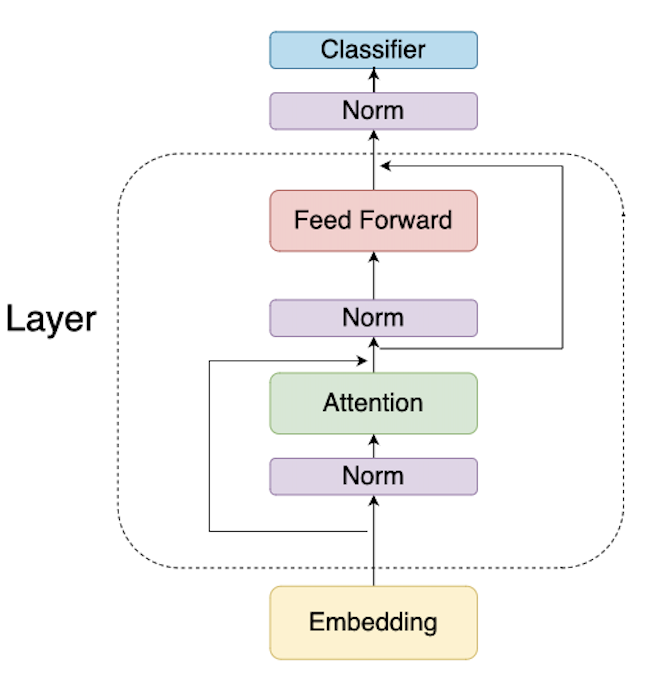
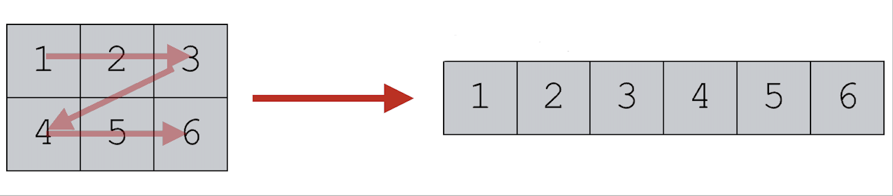
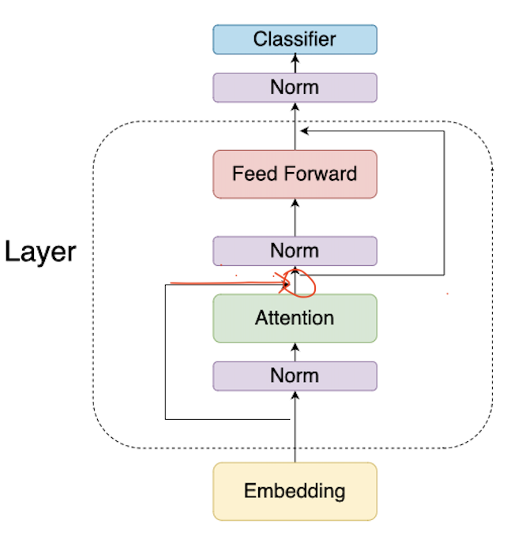

# llama2.c-for-dummies

### Purpose
This repo is line by line go through of the inference file in [llama2.c](http://github.com/karpathy/llama2.c). Its very verbose & intended for beginners.

You will need some familiarity with transformers architecture. If you are a complete novice refer to this excellent [blog](https://jalammar.github.io/illustrated-transformer/) first.

----

### Prerequisites

1. Transformer architecture: 3 components
	1. Embedding (1 matmul)
	2. Layers: matmul with Q, K , V, O and feed foward weights: W1, W2, W3 (7 matmul)
	3. Classifier: In our case the classifier is just matmul of `(vocab,768) x (768,1)` . Basically giving us what is the probability of each next token. (1 matmul)




## Code walkthrough

Code has 3 parts, structs, functions & read logic in `main()` we will take a look at structs first, then go to main() and then cover each function.

**PS: The code was taken from commit 4e23ad83. The original repo might be different as it gets newer commits.** But 99% of the logic should remain the same :) 

### Part 1: Structs

We define 3 structs for storing model config, model weights & to store intermediate values (run state) during forward pass

1. **Config struct**: Defines the transformer model.
	1. `n_layers` , `vocab_size`  : Self explanatory
	2. `dim` and `hidden_dim` : Define shape of Q, K, V & O and W1, W2 & W3 params.
	3. `n_heads` : Number of heads for query(Q). If `n_heads=12` then matrix `Q=(768,768)` behaves/viewed as `(12,768/12,768)`
	4. `n_kv_heads` : Number of heads for K & V. **Why are these different from above?** : Read [multi query paper](https://arxiv.org/pdf/1911.02150.pdf)
	5. `seq_len` : No. of tokens we will generate
```c
typedef struct {
    int dim; // transformer dimension
    int hidden_dim; // for ffn layers
    int n_layers; // number of layers
    int n_heads; // number of query heads
    int n_kv_heads; // number of key/value heads (can be < query heads because of multiquery)
    int vocab_size; // vocabulary size, usually 256 (byte-level)
    int seq_len; // max sequence length
} Config;
```

---

2. **Weight struct** for llama. This is our pytorch `ffn=nn.Linear(...)` counterpart. 
	1. Why are they `float*`  ? Because all matrices are just 1d flattened array. See below diagram
	2. code is self explanatory with shapes commented.   `rms_`  are weights used for normalization & `freq_cis_` are for [RoPE embedding](https://arxiv.org/pdf/2104.09864.pdf). We will look at `RoPE` in detail ahead.
	3. `wcls` is the final classifier. Matrix of size `(vocab, dim)` that maps final embedding from a vector to probability for each token in vocab.
```c
typedef struct {
    // token embedding table
    float* token_embedding_table;    // (vocab_size, dim)
    // weights for rmsnorms
    float* rms_att_weight; // (layer, dim) rmsnorm weights
    float* rms_ffn_weight; // (layer, dim)
    // weights for matmuls
    float* wq; // (layer, dim, dim)
    float* wk; // (layer, dim, dim)
    float* wv; // (layer, dim, dim)
    float* wo; // (layer, dim, dim)
    // weights for ffn
    float* w1; // (layer, hidden_dim, dim)
    float* w2; // (layer, dim, hidden_dim)
    float* w3; // (layer, hidden_dim, dim)
    // final rmsnorm
    float* rms_final_weight; // (dim,)
    // freq_cis for RoPE relatively positional embeddings
    float* freq_cis_real; // (seq_len, dim/2)
    float* freq_cis_imag; // (seq_len, dim/2)
    // (optional) classifier weights for the logits, on the last layer
    float* wcls;
} TransformerWeights;
```



---

3. Intermediate activations (Run state)
	1. During forward pass we need to store intermediate values, e.g. output of matmul or output after norm. Will take a look at all variables later
	2. `key_cahce` and `value_cache` store the key, value outputs of previous tokens. e.g. during inference if the 5th token is being generated, this will store `key`, `value` of previous 4.

```c
typedef struct {
    // current wave of activations
    float *x; // activation at current time stamp (dim,)
    float *xb; // same, but inside a residual branch (dim,)
    float *xb2; // an additional buffer just for convenience (dim,)
    float *hb; // buffer for hidden dimension in the ffn (hidden_dim,)
    float *hb2; // buffer for hidden dimension in the ffn (hidden_dim,)
    float *q; // query (dim,)
    float *k; // key (dim,)
    float *v; // value (dim,)
    float *att; // buffer for scores/attention values (n_heads, seq_len)
    float *logits; // output logits
    // kv cache
    float* key_cache;   // (layer, seq_len, dim)
    float* value_cache; // (layer, seq_len, dim)
} RunState;
```

---

We will take a look at functions as we encounter them. For now lets see the logic inside `main()` 

### Part 2: Main (Can skip this part if you are only interested in [forward logic](#actual-forward-pass) )

1. Get command line arguments. Nothing interesting.  Currently you can call `run.c` with
	1. `./run llama2_7b.bin`
	2. `./run llama2_7b.bin 0.1` -> with temperature
	3. `./run llama2_7b.bin 0.1 100` -> with temperature & steps (no. of output tokens generated)
 
2. Declare `config` & `weights` in the end
```c
int main(int argc, char *argv[]) {
    // poor man's C argparse
    char *checkpoint = NULL;  // e.g. out/model.bin
    float temperature = 0.9f; // e.g. 1.0, or 0.0
    int steps = 256;          // max number of steps to run for, 0: use seq_len
    // 'checkpoint' is necessary arg
    if (argc < 2) {
        printf("Usage: %s <checkpoint_file> [temperature] [steps]\n", argv[0]);
        return 1;
    }
    if (argc >= 2) {
        checkpoint = argv[1];
    }
    if (argc >= 3) {
        // optional temperature. 0.0 = (deterministic) argmax sampling. 1.0 = baseline
        temperature = atof(argv[2]);
    }
    if (argc >= 4) {
        steps = atoi(argv[3]);
    }
	// seed rng with time. if you want deterministic behavior use temperature 0.0
    srand((unsigned int)time(NULL)); 
    // read in the model.bin file
    Config config;
    TransformerWeights weights;
```

2. Reading `checkpoint` file. 
	1. If you are familiar with PyTorch. Usually  `config.json` & `model.bin` are separate (we load weights like a dictionary). But here `train.py` saves everything in one `.bin`  file in a specific format. This specific format allows us to easily read config & then each weight one by one.

	Details
	1.  `shared_weights` : Should input embedding matrix & output classifier matrix be same? 
	2. Next load into `weights`. Get file size via `file_size = ftell(file);` Unlike vanilla PyTorch inference we **don't** load all weights into RAM. Instead we call `mmap(..)` to allocate RAM memory when we want lazily. For more detail [read](https://stackoverflow.com/questions/5877797/how-does-mmap-work
	3. Finally  call `checkpoint_init_weights`  (snippet of function below). Here we map our weight pointers to correct address returned by `mmap`. Since we already read config we offset for it in line  `float* weights_ptr = data + sizeof(Config)/sizeof(float);`
```c
void checkpoint_init_weights(TransformerWeights *w, Config* p, float* f, int shared_weights){
float* ptr = f;
w->token_embedding_table = ptr;
ptr += p->vocab_size * p->dim;
w->rms_att_weight = ptr;
.......
}
```

Original code we are talking about in above section
```c
    int fd = 0;
    float* data = NULL;
    long file_size;
    {
        FILE *file = fopen(checkpoint, "rb");
        if (!file) {
            printf("Unable to open the checkpoint file %s!\n", checkpoint);
            return 1;
        } 
	    // read in the config header
        if(fread(&config, sizeof(Config), 1, file) != 1) { return 1; }
        // negative vocab size is hacky way of signaling unshared weights. bit yikes.
        int shared_weights = config.vocab_size > 0 ? 1 : 0;
        config.vocab_size = abs(config.vocab_size);
        // figure out the file size
        fseek(file, 0, SEEK_END); // move file pointer to end of file
        file_size = ftell(file); // get the file size, in bytes
        fclose(file);
        
        // memory map the Transformer weights into the data pointer
        fd = open(checkpoint, O_RDONLY); // open in read only mode
        if (fd == -1) { printf("open failed!\n"); return 1; }
        data = mmap(NULL, file_size, PROT_READ, MAP_PRIVATE, fd, 0);
        if (data == MAP_FAILED) { printf("mmap failed!\n"); return 1; }
        float* weights_ptr = data + sizeof(Config)/sizeof(float);
        checkpoint_init_weights(&weights, &config, weights_ptr, shared_weights);
    }
```

---

3. Reading vocab file -> Mostly straightforward, only few details
	1. `vocab` is `char**` since each token is a string & `vocab` is a list of tokens.
	2. For loop over `vocab_size` & read each token
```c
// right now we cannot run for more than config.seq_len steps
    if (steps <= 0 || steps > config.seq_len) { steps = config.seq_len; }
    // read in the tokenizer.bin file
    char** vocab = (char**)malloc(config.vocab_size * sizeof(char*));
    {
        FILE *file = fopen("tokenizer.bin", "rb");
        if (!file) {
            printf("Unable to open the tokenizer file tokenizer.bin! Run "
            "python tokenizer.py to convert tokenizer.model -> tokenizer.bin\n");
            return 1;
        }
        int len;
        for (int i = 0; i < config.vocab_size; i++) {
            if(fread(&len, sizeof(int), 1, file) != 1) { return 1; }
            vocab[i] = (char *)malloc(len + 1);
            if(fread(vocab[i], len, 1, file) != 1) { return 1; }
            vocab[i][len] = '\0'; // add the string terminating token
        }
        fclose(file);
    }
```

---

#### Forward Loop in main (Go to [important part](#actual-forward-pass))

1. Allocate memory for run state/intermediate values. The first `token` we pass into our model is BOS token ("Beginning of Statement") who's vocab index is `1`. 
```c
	RunState state;
    malloc_run_state(&state, &config);
    
    // the current position we are in
    long start = time_in_ms();
    int next;
    int token = 1; // 1 = BOS token in Llama-2 sentencepiece
    int pos = 0;
    printf("<s>\n"); // explicit print the initial BOS token (=1), stylistically symmetric
```

2. Forward loop:
	1. `transformer(token, pos, &config, &state, &weights);` stores classifier score of each token as being the next token in sequence inside `state.logits`.(contents of `transformer` function convered in next section). 
	2. Next we sample. Greedy sample is trivial, get max in `state.logits` array. For `temperate>0`  convert `state.logits` into probabilities using softmax & store back in `state.logits`. The `sample(..)` function returns a token sampled from the `state.logits` probability distribution. Read more [here](https://web.mit.edu/urban_or_book/www/book/chapter7/7.1.3.html) 
	3. The token generated `next` becomes the next input token in line `token=next`. 
```c
while (pos < steps) {
        // forward the transformer to get logits for the next token
        transformer(token, pos, &config, &state, &weights);
        // sample the next token
        if(temperature == 0.0f) {
            // greedy argmax sampling
            next = argmax(state.logits, config.vocab_size);
        } else {
            // apply the temperature to the logits
            for (int q=0; q<config.vocab_size; q++) { state.logits[q] /= temperature; }
            // apply softmax to the logits to get the probabilities for next token
            softmax(state.logits, config.vocab_size);
            // we now want to sample from this distribution to get the next token
            next = sample(state.logits, config.vocab_size);
        }
        printf("%s", vocab[next]);
        fflush(stdout);

        // advance forward
        token = next;
        pos++;
    }
```
---

### Actual Forward pass

Details of `transformer(token, pos, &config, &state, &weights);` called from `main()`

Section below uses 2d/3d array indexing extensively. We cover it briefly here to make life easier

1. If matrix `float* mat` is of size `(dim1, dim2, dim3)` then pointer to access `mat[l][i][j]` is `dim2*dim3*l + dim3*i + j;` -  This is `formula-1` we will refer to this often later. Read [link](https://www.learncpp.com/cpp-tutorial/pointer-arithmetic-and-array-indexing/) if you are confused

How to view matrices in terms of head?
1.  K (key) `float* wk` is a matrix defined as shape `(layer, dim, dim)` when viewed in terms of heads is `(layer, dim, n_heads, head_dim)`
---

1. Convenience variables. Nothing interesting apart from copying the embedding of `token` into `s->xb` using `memcpy`. Why not use `float* content_row` itself? Because  `s->xb` is going to change & using `content_row` will change model weights.
```c
void transformer(int token, int pos, Config* p, RunState* s, TransformerWeights* w) {
    // a few convenience variables
    float *x = s->x;
    int dim = p->dim;                  
    int hidden_dim =  p->hidden_dim;  
    int head_size = dim / p->n_heads; 
    float* content_row = &(w->token_embedding_table[token * dim]);
    // copy the token embedding into x
    memcpy(x, content_row, dim*sizeof(*x)); 
```

---
**RoPE** : Rotary Positional Embeddings 
- Formulation:  Transforms feature pairs by rotating it in 2D plane.
	e.g. If your vector is `[0.8, 0.5, -0.1, 0.3]` we group them into pairs: `[[0.8,-0.1], [0.5, 0.3]` and rotate by some angle $\theta$. This $\theta$ is part of the weights & is learned during training. 

RoPE  Formula (For 2 features grouped into a pair) is below. $m$ is the index of the pair. $\theta$ is a learned parameter that we load from `.bin` file

$$
  \left[ {\begin{array}{ccccc}
   x_{m}^{i} & x_{m}^{j} \\
  \end{array} } \right] * \left[ {\begin{array}{ccccc}
   cos(m\theta_{m}) & -sin(m\theta_{m}) \\
   sin(m\theta_{m}) & cos(m\theta_{m}) \\
  \end{array} } \right]
$$

Our example pair `[[0.8,-0.1], [0.5, 0.3]`  will be transformed like below. Keep in mind for the first pair `[0.8, 0.1]` $m=0$ since (therefore $sin(0)=0$). And for 2nd pair `m=1`

$$
  \left[ {\begin{array}{ccccc}
   0.8 & -0.1 \\
  \end{array} } \right] * \left[ {\begin{array}{ccccc}
   1 * 1 & -0.0 * 1 \\
   0.0 * 1 & 1.0 * 1 \\
  \end{array} } \right] =    \left[ {\begin{array}{ccccc}
   0.8 & -0.1 \\
  \end{array} } \right]
$$

$$
  \left[ {\begin{array}{ccccc}
   0.5 & 0.3 \\
  \end{array} } \right] * \left[ {\begin{array}{ccccc}
   0.86 * 1 & -0.5 * 1 \\
   0.5 * 1 & 0.86 * 1 \\
  \end{array} } \right] =    \left[ {\begin{array}{ccccc}
   0.58 & 0.08 \\
  \end{array} } \right]
$$

Combining both, the output is `[[0.8, 0.1], [0.58, 0.08]]` now **un-pairing** them will give us `[0.8, 0.58, 0.1, 0.08]`
So `RoPE` transformed `[0.8, 0.5, -0.1, 0.3]` into `[0.8, 0.58, 0.1, 0.08]`. Keep in mind if a feature is of `dim=768` then there are half of it **384** learnable $\theta$'s. 

**Back to code**
1. We get $\theta$ for current position (`pos` is our $m$).  `freq_cis_real_row` is $cos(m\theta)$ and `freq_cis_imag_row` is $sin(m\theta)$.
```c
    // pluck out the "pos" row of freq_cis_real and freq_cis_imag66
    float* freq_cis_real_row = w->freq_cis_real + pos * head_size / 2;
    float* freq_cis_imag_row = w->freq_cis_imag + pos * head_size / 2;
```

2. Iterate over layers. Apply `rmsnorm` to input of the layer.  `rmsnorm` function calculates the below

```math
out\; = \;  (x*g*n)/\sum_{i} \sqrt{x_{i}^{2}} 
```
where $x$ is input, $g$ is learnable parameter (`w->rms_attn_weight` below) & $n$ is `dim`.

`matmul` does matrix mult of a 2d matrix with a 1d matrix. `(A, B) x (A,)`. The implementation is trivial (we cover this at very end). We multiply Q,K,V with `s->xb` (output of `rmsnorm`) and store output in `s->q`, `s->k` ..
```c
for(int l = 0; l < p->n_layers; l++) {
// attention rmsnorm
	rmsnorm(s->xb, x, w->rms_att_weight + l*dim, dim);
	
	// qkv matmuls for this position
	matmul(s->q, s->xb, w->wq + l*dim*dim, dim, dim);
	matmul(s->k, s->xb, w->wk + l*dim*dim, dim, dim);
	matmul(s->v, s->xb, w->wv + l*dim*dim, dim, dim);
```
3. Go over each head & apply the 2-d $cos$/$sin$ transformation we discussed above to `s->q` and `s->k`. We do it separately for each head, therefore we take offset of `h*head_size`
```c
// apply RoPE rotation to the q and k vectors for each head
        for (int h = 0; h < p->n_heads; h++) {
            // get the q and k vectors for this head
            float* q = s->q + h * head_size;
            float* k = s->k + h * head_size;
            // rotate q and k by the freq_cis_real and freq_cis_imag
            for (int i = 0; i < head_size; i+=2) {
                float q0 = q[i];
                float q1 = q[i+1];
                float k0 = k[i];
                float k1 = k[i+1];
                float fcr = freq_cis_real_row[i/2];
                float fci = freq_cis_imag_row[i/2];
                q[i]   = q0 * fcr - q1 * fci;
                q[i+1] = q0 * fci + q1 * fcr;
                k[i]   = k0 * fcr - k1 * fci;
                k[i+1] = k0 * fci + k1 * fcr;
            }
        }
```


4. Once we get `q, k, v` for current token, we need to calculate self-attention. Where we multiply query into key.  `k & v` are only for the current token. We store the `k, v` for all past tokens in `key_cache_row`  & `value_cache_row`.
	- For example, if we have generated the tokens ("fox", "jumps", "over") until now then we already have Q & V for "fox" & "jumps" from previous forward passes stored in our cache. We need not recalculate.
	- Since caches store key, query for all layers & for all tokens (max no.of tokens is `seq_length`) its dimensions are `(layer, seq_length, dim)`. `seq_length` is usually called `context`. 
5. Consider below code in terms of above example. Lets say `seq_length=32` (which means we generate at-most 32 tokens). `pos=2` since "fox" is the 3rd token (2nd since python is 0-indexed). 
	- We already have `layer*(pos-1)*dim` values filled in `s->key_cache` We need to fill the key, value of current token "fox" into `s->key_cache` too before doing self-attention. This is what `memcpy(key_cache_row, s->k, dim*sizeof(*key_cache_row));` does
```c
// save key,value at this time step (pos) to our kv cache
int loff = l * p->seq_len * dim; // kv cache layer offset for convenience
float* key_cache_row = s->key_cache + loff + pos * dim;
float* value_cache_row = s->value_cache + loff + pos * dim;
memcpy(key_cache_row, s->k, dim*sizeof(*key_cache_row));
memcpy(value_cache_row, s->v, dim*sizeof(*value_cache_row));
```

### Doing self-attention

Formula

```math
\begin{align} 
out = (QK^{T})\;V/\sqrt{d} \\
where\;\;\; Q=(1,dim) \;\; K=(dim,N) \;\; V=(dim,N)
\end{align}
```
In above $N$ is `pos` (current length of the generated text)


This part of the code becomes easy if you remember that `s->q`, `s->k` when viewed in terms of heads are of shape `(dim, n_heads, head_dim)` & `key_cache`'s are `(seq_length, n_heads, head_dim)`. Lets go over the code
 1. `int h` is the current head count. Lets look at each line one by one
	 1. `q = s->q + h*head_size` :  Gets pointer to start of $h^{th}$ head. Remember `formula-1`. Matrix is of size `(dim, n_heads, head_dim)` we need `s->q[0][h][0]` which is `0*n_heads*head_dim + h*head_dim + 0` which is `h*head_size`. 
	 2. `att = s->att + h * p->seq_len`: We will store attention in `s->attn` run state variable.
	 3. For each position (`pos` is 2 currently if you go back to "fox", "jumps", "over" example) 
			 1.To get  $l^{th}$ layer, $t^{th}$ position & $h^{th}$ head we do `s->key_cache + l*seq_length*dim + t*n_heads*head_dim + h*head_dim` . Since `loff` defined before is already `l*seq_length*dim`. Final offset is `loff + t*n_heads*head_dim + h*head_size` since `n_heads*head_dim=dim` we get offset as `loff + t*dim + h*head_size`.
	1. We now have `q` `(head_size,)`, `k` `(head_size,)`  & `att` `(seq_length,)`. We can calculate self-attention score for $h^{th}$ head at position $t$.  We sum this over all the heads & positions till now.
```c
	int h;        
	#pragma omp parallel for private(h)
	for (h = 0; h < p->n_heads; h++) {
	// get the query vector for this head
	float* q = s->q + h * head_size;
	// attention scores for this head
	float* att = s->att + h * p->seq_len;
	// iterate over all timesteps, including the current one
	for (int t = 0; t <= pos; t++) {
		// get the key vector for this head and at this timestep
		float* k = s->key_cache + loff + t * dim + h * head_size;
		// calculate the attention score as the dot product of q and k
		float score = 0.0f;
		for (int i = 0; i < head_size; i++) {
			score += q[i] * k[i];
		}
		score /= sqrtf(head_size);
		// save the score to the attention buffer
		att[t] = score;
 ```


2. `attn` obtained above is of shape `(seq_length, )`. Next we multiply it with `v` which is `(seq_length, dim)`. Remember the below loop is inside the `for (h = 0; h < p->n_heads; h++)` that started in previous section.

```c
// softmax the scores to get attention weights, from 0..pos inclusively
softmax(att, pos + 1);

// weighted sum of the values, store back into xb
float* xb = s->xb + h * head_size;
memset(xb, 0, head_size * sizeof(float));
for (int t = 0; t <= pos; t++) {
	// get the value vector for this head and at this timestep
	float* v = s->value_cache + loff + t * dim + h * head_size;
	// get the attention weight for this timestep
	float a = att[t];
	// accumulate the weighted value into xb
	for (int i = 0; i < head_size; i++) {
		xb[i] += a * v[i];
	}
}
```


---

### Feed Forward & Classifier

1. To complete attention module, we need to multiply with $O$ which we do in first line. Next line `accum` adds input which comes from skip layer (red arrow) & output of attention. Followed by normalization.

```c
// final matmul to get the output of the attention
matmul(s->xb2, s->xb, w->wo + l*dim*dim, dim, dim);
// residual connection back into x
accum(x, s->xb2, dim);
// ffn rmsnorm
rmsnorm(s->xb, x, w->rms_ffn_weight + l*dim, dim);
```



2. Next we calculate the FFN output which is
```math
out = W_{3}(W_{1}X*W_{2}X)
```
This portion is self explanatory 
```c
// Now for FFN in PyTorch we have: self.w2(F.silu(self.w1(x)) * self.w3(x))
// first calculate self.w1(x) and self.w3(x)
matmul(s->hb, s->xb, w->w1 + l*dim*hidden_dim, dim, hidden_dim);
matmul(s->hb2, s->xb, w->w3 + l*dim*hidden_dim, dim, hidden_dim);
// F.silu; silu(x)=x*σ(x),where σ(x) is the logistic sigmoid
for (int i = 0; i < hidden_dim; i++) {
	s->hb[i] = s->hb[i] * (1.0f / (1.0f + expf(-s->hb[i])));
}
// elementwise multiply with w3(x)
for (int i = 0; i < hidden_dim; i++) {
	s->hb[i] = s->hb[i] * s->hb2[i];
}
// final matmul to get the output of the ffn
//memcpy(tmp_w_hid, w->w2 + l*dim*hidden_dim, hidden_dim*dim*sizeof(float));
matmul(s->xb, s->hb, w->w2 + l*dim*hidden_dim, hidden_dim, dim);
```
3. The last line is another accum (2nd skip layer in above diagram)
```c
accum(x, s->xb, dim);
```


---

### Final Classifier

After running above module for all layers, we get an embedding of shape `(dim,)`. We need to convert this into a vector of shape `(vocab,)` whose each entry tells us what is the score for that word to be next token.

1. Before multiplying with classifier matrix (`w->wcls`) we normalize our embedding. The scores our saved in `s->logits`
```c
// final rmsnorm
rmsnorm(x, x, w->rms_final_weight, dim);
// classifier into logits
matmul(s->logits, x, w->wcls, p->dim, p->vocab_size);
```

---
### The end

Once we get `s->logits` we sample which has already been covered above.  Congratulations now you know how LLMs work. Here is a picture of a cat :) 


